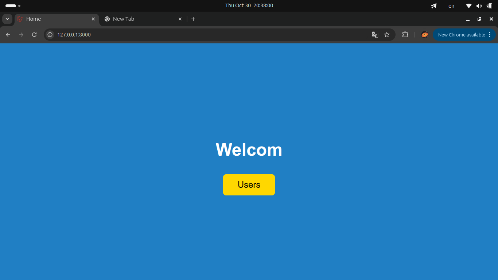
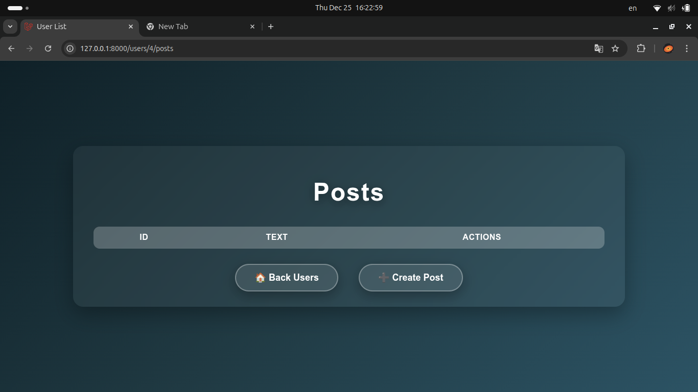
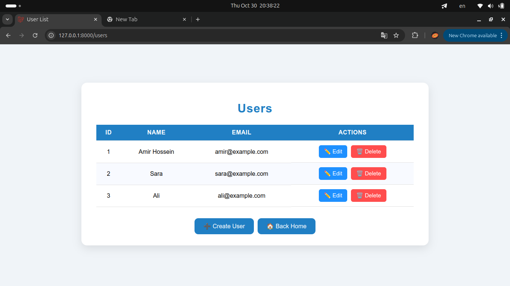
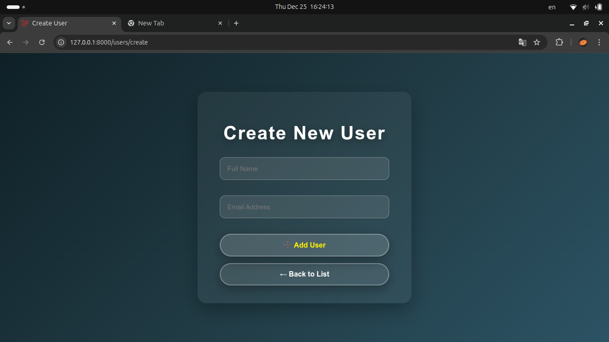
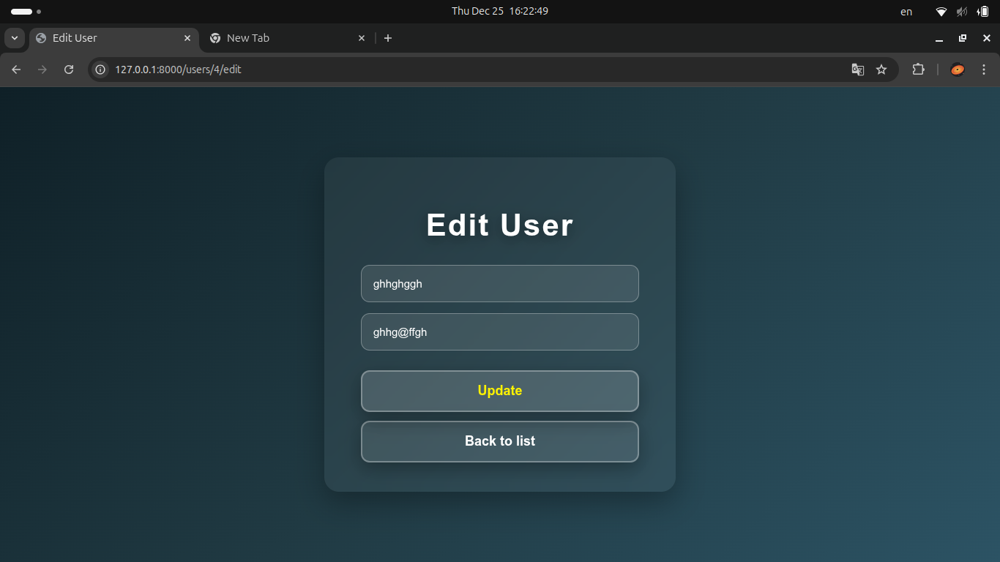

<p align="center">
  
</p>

<h1 align="center">🌐 Web Page My Version</h1>

<p align="center">
A simple Laravel project demonstrating CRUD operations for users with RESTful routes (simulation, without database).  
Styled with clean CSS and responsive design.  
</p>

---

## 🛠️ Features

- Home page with welcome message  
- Users list with Edit and Delete buttons  
- Create user page (simulation)  
- Edit user page (simulation)  
- Fully responsive and clean UI using CSS  
- Simple, clear routing using Laravel Resource-style routes  

---

## 📝 Exercises Included

### Exercise 2
- RESTful routes for users  
- No database operations  
- Simulation using PHP arrays  

### Exercise 3
- Full CRUD operations for users  
- Uses database migrations  
- Eloquent ORM for models  
- Controller implementation  

### Exercise 4
- CRUD operations for users, posts, and comments  
- Relational models using Laravel relationships  
- Resource-style routes  

### Exercise 5 | Project
- Full repository setup  
- At least 12 database tables  
- CRUD operations for all models  
- Real database integration  

---

## 🖼️ Screenshots

### Home Page


### Posts


### Users List


### Create User


### Edit User


---

## 🛠️ Installation & Run

Follow these steps to set up the project locally:

### 1️⃣ Clone the repository
```bash
git clone https://github.com/Amir-Hossein-Keshmiri/web-page-my-version.git
cd web-page-my-version
```

### 2️⃣ Install dependencies

```bash
composer install
npm install
```

### 3️⃣ Create .env file

```bash
cp .env.example .env
php artisan key:generate
```

### 4️⃣ Serve the project

```bash
php artisan serve
```

### 5️⃣ Open in browser

```bash
Visit: http://127.0.0.1:8000
```

---

### 📂 Project Structure

```bash
web-page-my-version/
│
├── app/                # Controllers & Models
├── resources/
│   ├── views/          # Blade templates
│   ├── css/            # CSS files for each page
│   └── js/             # JS files
├── public/             # Public assets
├── screenshots/        # Screenshots used in README
├── routes/web.php      # Routes
└── README.md           # This file
```

---

### 🔧 Notes

Exercise 2: CRUD simulated, no real database changes

Exercise 3: CRUD with database using migrations and Eloquent

Exercise 4: CRUD with relational models (users, posts, comments)

Exercise 5: Full project with at least 12 tables and complete CRUD

Routes:

Home: /

Users List: /users

Create User: /users/create

Edit User: /users/{id}/edit

---

<p align="center">
Made with ❤️ by Amir Hossein Keshmiri
</p>
